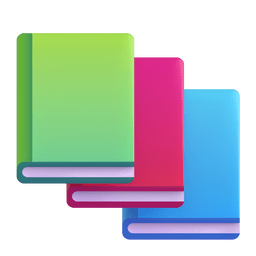
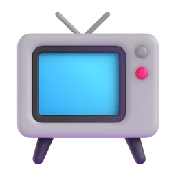

<!-- Header Section -->

   

<h1 align="center">Hi , I'm Aayush Yash</h1>
<h3 align="center">Python Backend & AI Engineer | FastAPI • Computer Vision • RAG </h3>

  
  
  

##  About Me

Backend & AI engineer focused on building document intelligence pipelines, local-first RAG systems, and asynchronous backend services with **Python, FastAPI, PyTorch, and SQL**, alongside frontend engineering with **TypeScript and React**.

>  *Engineering focus: building resilient OCR/vision extraction pipelines and low-latency retrieval architectures.*

---

##  Open Source Contributions

### [QwenLM/qwen-code](https://github.com/QwenLM/qwen-code) — [PR #1890](https://github.com/QwenLM/qwen-code/pull/1890) (Merged)
Fixed a Windows compatibility bug where CRLF line endings caused externally-created subagents, skills, and Claude-converted agents to fail silently ([Issue #1868](https://github.com/QwenLM/qwen-code/issues/1868)).
- **Root Cause**: Core parsers relied on newline-sensitive regex patterns expecting only `\n`, failing on Windows `\r\n` content.
- **Architecture & Refactoring**: Introduced a centralized `normalizeContent()` utility for BOM stripping and CRLF normalization, replacing duplicate parsing logic across subagent, skill, and converter modules.
- **Verification**: Added regression and integration test suites; verified on Windows 11 with all 13 automated checks passing.

---

##  Featured Projects

###  [Bharat-ID-Validator](https://github.com/Aayushyaash/Bharat-ID-Validator)
FastAPI pipeline for Indian identity document classification and OCR field extraction.
- **Engineering Choice**: Two-phase OCR with YOLO-based orientation correction reduces invalid text extraction noise.
- **Results**: 98%+ classification accuracy across 7 document formats (50+ field classes); ~80% latency reduction over naive whole-image OCR passes.
- **Stack**: `FastAPI`, `PyTorch`, `YOLO`, `OpenCV`, `Pydantic`, `pytest`

###  [Rag-chatbot](https://github.com/Aayushyaash/Rag-chatbot)
Privacy-first RAG engine for multi-document PDF querying.
- **Engineering Choice**: Hybrid semantic + BM25 keyword search unified via Reciprocal Rank Fusion (RRF) to mitigate precision loss in vector-only search for exact domain identifiers.
- **Privacy & Execution**: Local chunk embedding storage; switchable local vs cloud inference pipeline with deduplication.
- **Stack**: `FastAPI`, `ChromaDB`, `PyTorch`, `Gemini API`, `HuggingFace`

### 🎭 [MITRA Theatre — Live Site](https://mitraproductions.com/)
Cinematic theatre company website — designed, built, and deployed independently for a live theatre organization.
- **Engineering**: Automated local validation pipeline — Husky pre-commit/pre-push hooks, Knip dead-code detection, Conventional Commits enforcement, and Vitest + Playwright browser testing.
- **Frontend**: React 19 + TypeScript, Framer Motion, custom cinematic intro/loading sequence, modular component hierarchy, and dark-theatrical design system.
- Source code is private.
- **Stack**: `React 19`, `TypeScript`, `Vite`, `Framer Motion`, `Vitest`, `Playwright`

###  [MindMate-AI](https://github.com/Aayushyaash/MindMate-AI)
Collaborative AI mental health platform *(Team Project — Original repository maintained by team lead)*.
- **My Contributions**: Real-time voice pipeline (Twilio WebRTC + ElevenLabs TTS), asynchronous WebSocket consumers, PHQ-9 assessment and scoring workflows, and JWT authentication.
- **Stack**: `Django`, `Redis Channels`, `WebSockets`, `Twilio`, `ElevenLabs`

---

##  Technical Skills

<strong>Languages</strong>

 

<strong>Backend & Data</strong>

 

<strong>AI / ML, Retrieval & Computer Vision</strong>

 

<strong>Frontend, Testing & Developer Tools</strong>

 

---

   <b>Fun fact:</b> I enjoy music , anime , and reading light novels 

  

  

