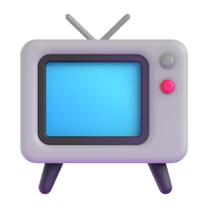
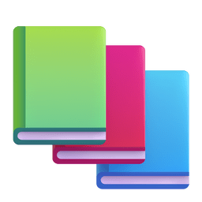

  

<h1 align="center">Hi , I'm Aayush Yash</h1>
<h3 align="center">Python Backend &amp; AI Engineer | Document Intelligence • RAG • Agent Tooling</h3>

  
  
  
  

I build asynchronous backend services, document intelligence pipelines, and local-first RAG architectures. Graduated in Computer Science (Batch of 2025) with a strong foundation in core algorithms and systems. The part of engineering I enjoy most is exploring new ideas, diving deep into how tools work under the hood, and building projects that push me to learn and grow both technically and personally.

<table>
  <tr>
    <td width="22%"><strong>Focus</strong></td>
    <td>Document intelligence (two-phase OCR &amp; orientation correction), low-latency hybrid RAG, agent toolchains, and async backend services.</td>
  </tr>
  <tr>
    <td><strong>Currently focusing</strong></td>
    <td>Deepening systems design, sharpening core algorithms and backend stack depth, and mastering AI pair-programming workflows.</td>
  </tr>
  <tr>
    <td><strong>Education</strong></td>
    <td><b>B.E. Computer Science and Engineering</b> — Batch of 2025.</td>
  </tr>
</table>

##  Open source

<!-- CONTRIB:START -->

  
  
  
  

### Merged upstream

** [`backnotprop/plannotator`](https://github.com/backnotprop/plannotator "Annotate and review coding agent plans and code diffs visually, share with your team, send feedback to agents with one click.")** Annotate and review coding agent plans and code diffs visually, share with your team, send feedback to agents with one click.
- [#1669](https://github.com/backnotprop/plannotator/pull/1669) fix(ai): show friendly error when opencode CLI is unavailable
- [#1658](https://github.com/backnotprop/plannotator/pull/1658) fix(ui): style Ask AI dropdown options for dark themes

** [`QwenLM/qwen-code`](https://github.com/QwenLM/qwen-code "An open-source AI coding agent that lives in your terminal.")** An open-source AI coding agent that lives in your terminal.
- [#1890](https://github.com/QwenLM/qwen-code/pull/1890) fix(windows): resolve silent failures caused by CRLF line endings (#1868)

** [`rtk-ai/rtk`](https://github.com/rtk-ai/rtk "CLI proxy that reduces LLM token consumption by 60-90% on common dev commands. Single Rust binary, zero dependencies")** CLI proxy that reduces LLM token consumption by 60-90% on common dev commands. Single Rust binary, zero dependencies
- [#3711](https://github.com/rtk-ai/rtk/pull/3711) feat(hook): add native Google Antigravity plugin lifecycle and hook support

### In review

<b>3 open pull requests across 2 repositories</b>

** [`rtk-ai/rtk`](https://github.com/rtk-ai/rtk "CLI proxy that reduces LLM token consumption by 60-90% on common dev commands. Single Rust binary, zero dependencies")** CLI proxy that reduces LLM token consumption by 60-90% on common dev commands. Single Rust binary, zero dependencies
- [#4343](https://github.com/rtk-ai/rtk/pull/4343) fix(hooks): recognize configured agent hooks in warning check (#913)
- [#4335](https://github.com/rtk-ai/rtk/pull/4335) fix(init): migrate legacy Antigravity rules on install and uninstall (#4317)

** [`backnotprop/plannotator`](https://github.com/backnotprop/plannotator "Annotate and review coding agent plans and code diffs visually, share with your team, send feedback to agents with one click.")** Annotate and review coding agent plans and code diffs visually, share with your team, send feedback to agents with one click.
- [#1646](https://github.com/backnotprop/plannotator/pull/1646) fix(plan): smooth sticky lane badge expansion and hover sync

### Contributed to

  
  
  

<!-- CONTRIB:END -->

  Updated nightly via GitHub Actions with <a href="https://github.com/Aayushyaash/pr-showcase">pr-showcase</a> · <a href="https://github.com/search?q=author%3AAayushyaash+is%3Apr+-user%3AAayushyaash&type=pullrequests">all pull requests →</a>

##  Featured projects

<table>
  <tr>
    <td width="50%" valign="top">
      <h3><a href="https://github.com/Aayushyaash/Bharat-ID-Validator">Bharat-ID-Validator</a></h3>
      
FastAPI pipeline for Indian identity document classification and OCR field extraction. Implemented two-phase OCR with YOLO-based orientation correction to eliminate text extraction noise on skewed scans. Achieved 98%+ classification accuracy across 7 document formats (50+ field classes) and ~80% latency reduction over naive whole-image OCR passes.

      <code>FastAPI</code> <code>PyTorch</code> <code>YOLO</code> <code>PaddleOCR</code> <code>OpenCV</code> <code>Pydantic</code> <code>pytest</code>
    </td>
    <td width="50%" valign="top">
      <h3><a href="https://github.com/Aayushyaash/Rag-chatbot">Rag-chatbot</a></h3>
      
Privacy-first local RAG engine for multi-document querying. Built hybrid semantic + BM25 keyword search unified via Reciprocal Rank Fusion (RRF) to eliminate vector-only precision loss on precise domain identifiers. Features local ChromaDB chunk storage and switchable local/cloud inference pipeline with deduplication.

      <code>FastAPI</code> <code>ChromaDB</code> <code>PyTorch</code> <code>HuggingFace</code> <code>Gemini API</code>
    </td>
  </tr>
  <tr>
    <td width="50%" valign="top">
      <h3><a href="https://mitraproductions.com/">MITRA Theatre</a> client project</h3>
      
Live cinematic website built independently for a live theatre production organization. Engineered an automated local validation pipeline (Husky pre-commit/pre-push hooks, Knip dead-code detection, Conventional Commits) paired with Vitest and Playwright browser integration testing.

      <code>React 19</code> <code>TypeScript</code> <code>Vite</code> <code>Framer Motion</code> <code>Vitest</code> <code>Playwright</code>
    </td>
    <td width="50%" valign="top">
      <h3><a href="https://github.com/Aayushyaash/MindMate-AI">MindMate-AI</a> team project</h3>
      
Collaborative AI mental health platform. Engineered the real-time voice pipeline (Twilio WebRTC + ElevenLabs TTS), asynchronous WebSocket consumers for low-latency session messaging, automated PHQ-9 clinical assessment workflows, and JWT authentication.

      <code>Django</code> <code>Redis Channels</code> <code>WebSockets</code> <code>Twilio</code> <code>ElevenLabs</code>
    </td>
  </tr>
</table>

<a href="https://github.com/Aayushyaash?tab=repositories&type=source">all repositories →</a>

##  Technical skills

### Languages

  
  
  
  
  

### Backend & Data

  
  
  
  

### AI & Computer Vision

  
  
  
  

### Frontend & DevOps

  
  
  
  
  

## Contact

Open to full-time **Python Backend Engineer**, **AI Engineer**, and **Software Engineer** roles (Remote or On-site).

- **Email**: [aayushyaash@outlook.com](mailto:aayushyaash@outlook.com)
- **LinkedIn**: [linkedin.com/in/aayush-yash](https://linkedin.com/in/aayush-yash)
- **Portfolio**: [aayushyaash.github.io/portfolio](https://aayushyaash.github.io/portfolio/)

---

   <b>Fun fact:</b> I enjoy music , anime , and reading light novels 

  

  

